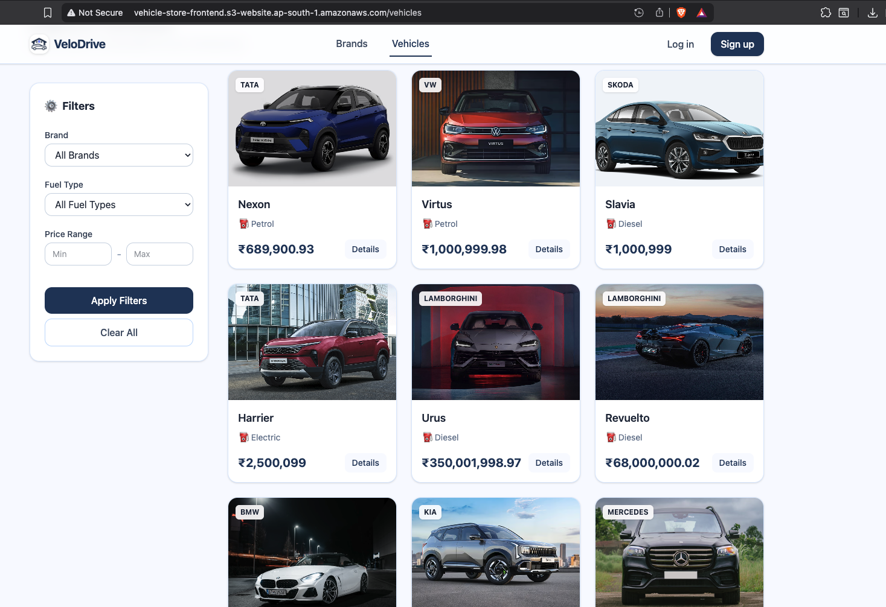
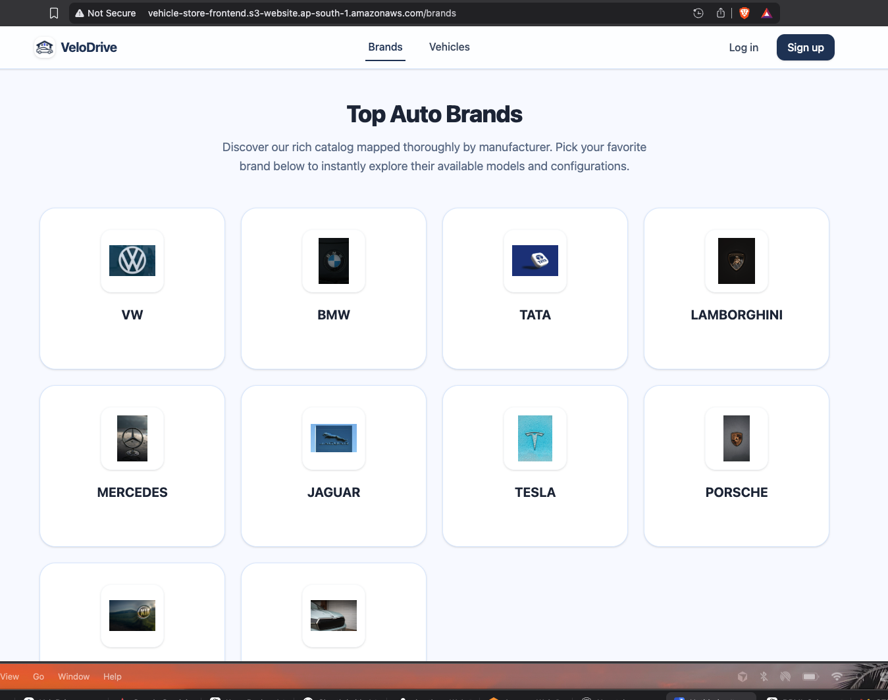
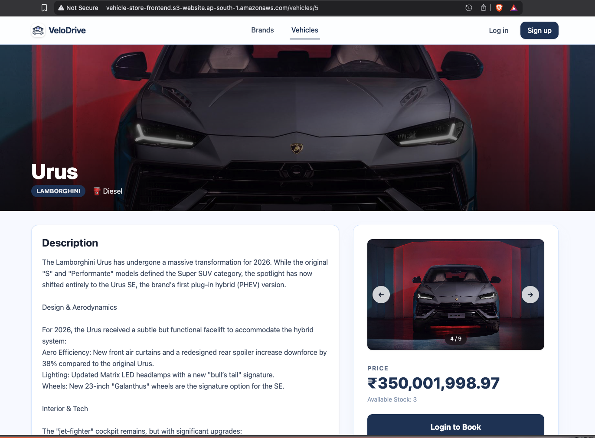
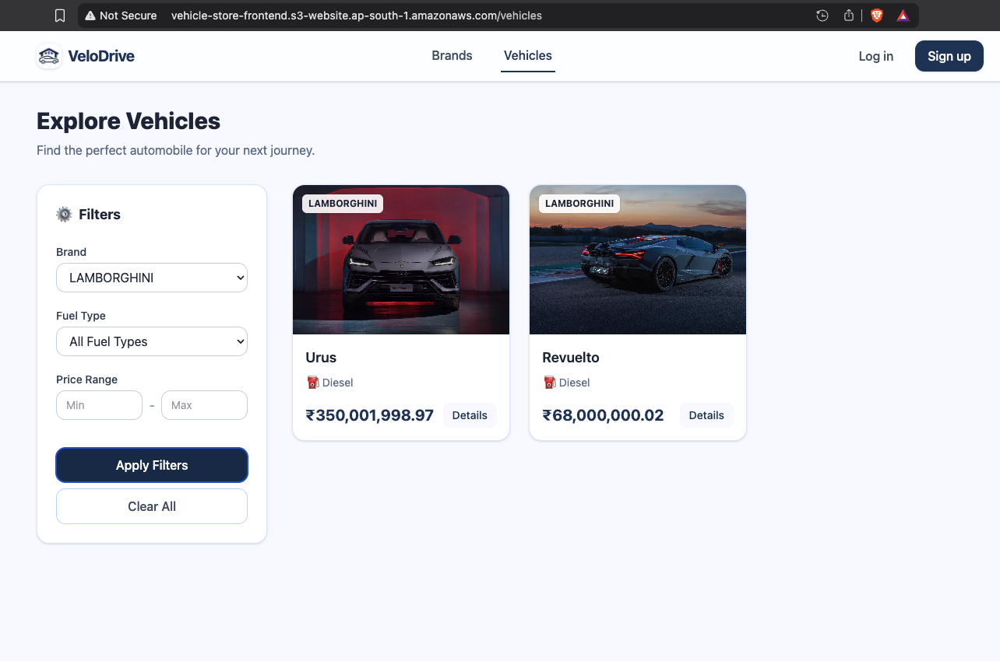
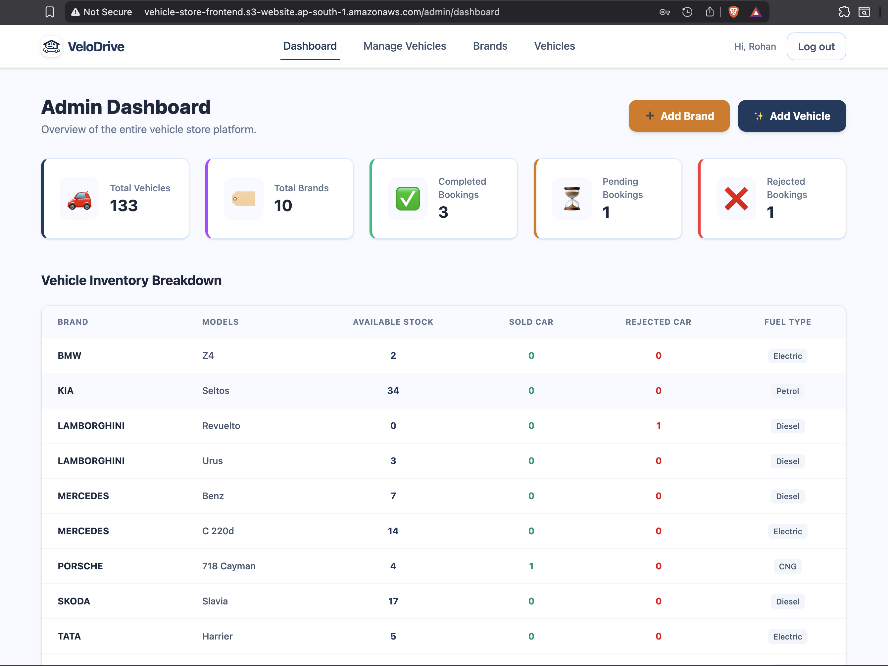
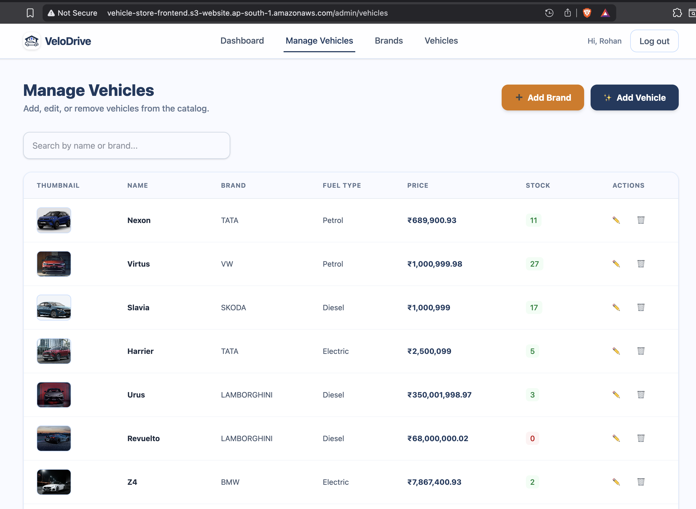
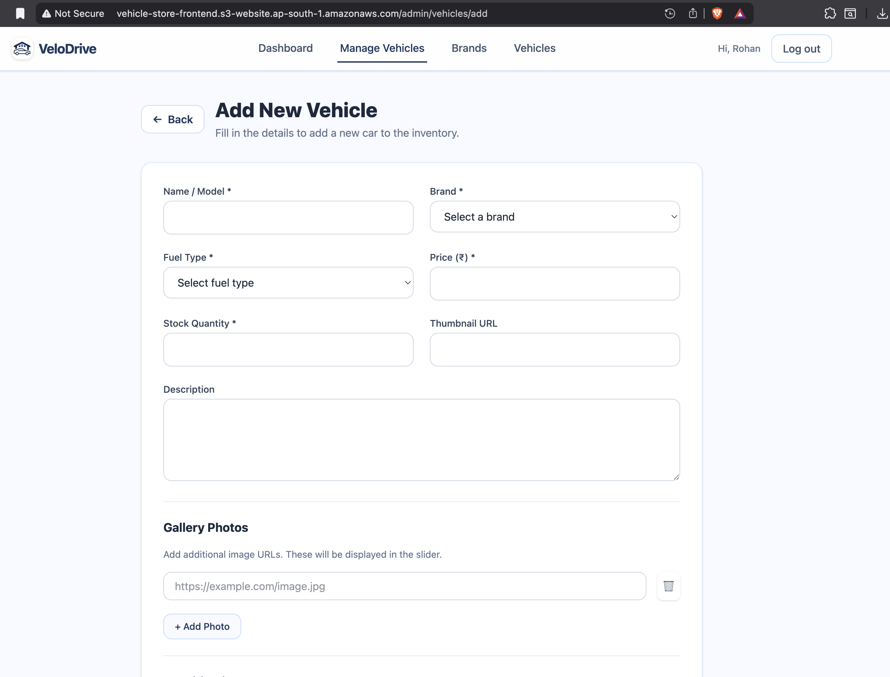
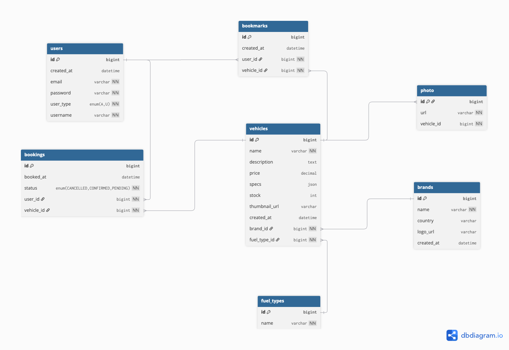

# VeloDrive - Multi-Brand Vehicle Store

## Overview
VeloDrive is a full-stack web application that serves as a comprehensive multi-brand vehicle store. It provides a modern, responsive frontend built with React (Vite) and a robust backend powered by Spring Boot, enabling users to browse, compare, and book vehicles while admins manage the entire inventory and bookings lifecycle.

---

## Live Demo & Deployment

- **Frontend (React + Vite on AWS S3)**  
  `http://vehicle-store-frontend.s3-website.ap-south-1.amazonaws.com/`  
  > If your browser automatically forces `https`, please manually switch it to `http` for the site to open correctly.

- **Backend (Spring Boot on AWS EC2)**  
  Deployed as a Spring Boot application running on an EC2 instance.

- **Database (MySQL on AWS RDS)**  
  All application data (users, vehicles, brands, bookings, bookmarks, etc.) is stored in a managed MySQL RDS instance.

---

## Demo Video

Click the thumbnail below to watch a short demo of VeloDrive:

[](https://vehicle-store.s3.ap-south-1.amazonaws.com/demo.mov)

---

## Features

### User-Facing
- **Vehicle Catalog**  
  Browse an extensive inventory of vehicles from multiple brands with intuitive filters and search.

  

- **Brand-wise Browsing**  
  Explore vehicles grouped by brand to quickly locate preferred manufacturers.

  

- **Detailed Vehicle Page**  
  View comprehensive details for each vehicle: price (₹), specifications, fuel types, images, and more.

  

- **Filtering & Search**  
  Filter vehicles based on brand, fuel type, transmission, and other attributes.

  

- **Bookmarks & Bookings**  
  Add vehicles to a wishlist (bookmarks) or raise a booking request directly from the catalog or detail page.

### Authentication & Authorization
- **Secure JWT-based Authentication**  
  Login and session handling are secured via JWT.
- **Role-Based Access Control**  
  Two main roles:
  - **Admin**
  - **Regular User**

---

## Admin Panel

- **Admin Dashboard**  
  Overview of inventory, bookings, and quick access to management actions.

  

- **Manage Vehicles & Brands**  
  Add, edit, or delete vehicles and brands through an intuitive admin UI.

  

- **Add / Update Vehicle Details**  
  Create new vehicles with photos, specs, and pricing, or update existing entries.

  

- **Booking Management**  
  Approve or reject user booking requests and view their status.

- **Analytics & Insights**  
  Track inventory status and completed vs pending bookings to understand system usage.

---

## Admin Credentials

Currently, there is **only one admin user** configured:

- **Username**: `Rohan`  
- **Password**: `temp123`

Use these credentials on the login page to access the admin dashboard.

### Regular Users

Regular users do not have default credentials.  
To use the application as a regular user, go through the registration flow on the frontend (Register/Sign Up), complete the form, and then log in with your new account to continue with browsing, bookmarking, and booking vehicles.

---

## Database Design

Below is the database schema diagram for the application, which highlights the normalized relationships between Users, Vehicles, Brands, Bookings, Bookmarks, Photos, and Fuel Types:



---

## Running the Project Locally

To run the project on your local machine, follow the steps below for both backend and frontend.

### Prerequisites
- **Java 17+** (for the Spring Boot backend)
- **Maven** (or use the included `mvnw` wrapper)
- **Node.js** (v18+ recommended for the React frontend)
- **Database**: MySQL or another supported relational database (ensure config matches your local setup).

### 0. Clone the Repository & Initial Configuration

1. Clone the repository from GitHub:
   ```sh
   git clone https://github.com/rohanjadhav05/vehicle-store.git
   cd vehicle-store
   ```
2. Configure the database connection in the backend:  
   Edit `store/src/main/resources/application.properties` (or `application.yml`) and set your database URL, username, and password (for example, your local MySQL instance or an RDS connection string).
3. Configure the backend URL in the frontend:  
   In `frontend/.env` (or by copying `frontend/.env_example`), set:
   ```env
   VITE_API_URL=http://localhost:8080/api
   ```
   or replace it with the URL of your deployed backend (for example, your EC2 backend URL).

### 1. Backend Setup (Spring Boot)

1. Navigate to the backend directory:
   ```sh
   cd store
   ```

2. Configure database connection:  
   Ensure your local database server is running, then update `src/main/resources/application.properties` (or `application.yml`) with the correct database URL, username, and password.

3. Build the project:
   ```sh
   mvn clean install
   ```

4. Start the Spring Boot server:
   ```sh
   mvn spring-boot:run
   ```
   The backend API should now be running at `http://localhost:8080`.

### 2. Frontend Setup (React + Vite)

1. Navigate to the frontend directory:
   ```sh
   cd frontend
   ```

2. Install dependencies:
   ```sh
   npm install
   ```

3. Configure environment variables:  
   In the `frontend` folder, create or update your `.env` file to point to your backend API, for example:
   ```env
   VITE_API_URL=http://localhost:8080/api
   ```

4. Start the development server:
   ```sh
   npm run dev
   ```
   The frontend will typically run on `http://localhost:5173` (check your terminal output for the exact URL).

---

